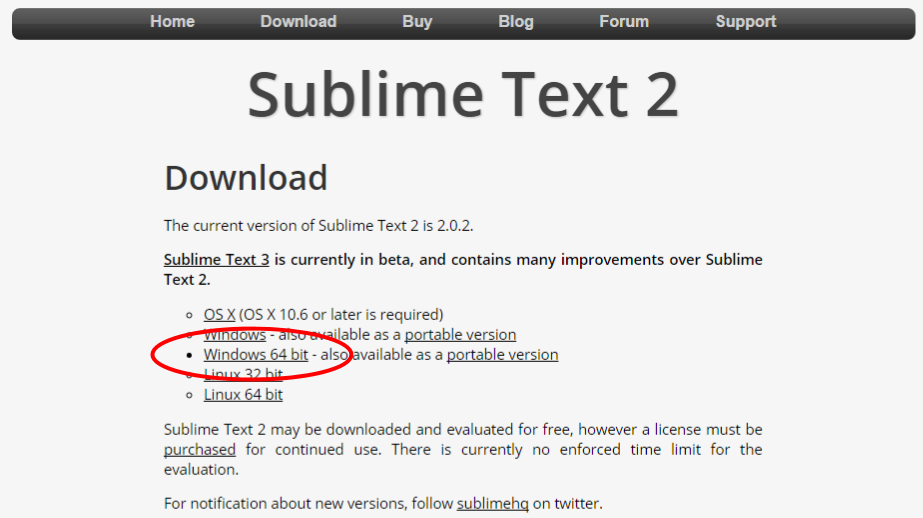
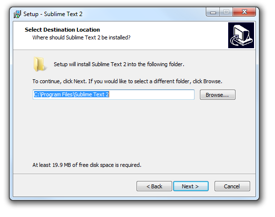
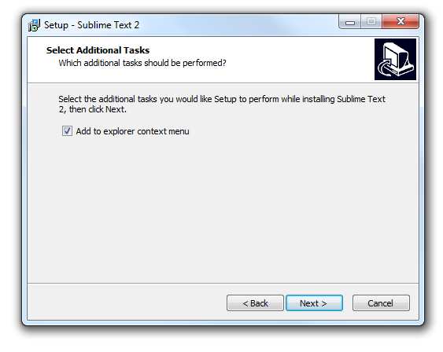
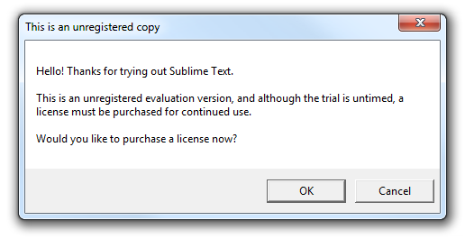

## Installing Sublime Text 3 on Windows

This guide is focused on how to install the Sublime Text 3 text editor on a Windows machine.

### Background

We will be using Sublime Text 3 as a code editor. Think of it as a souped-up version of Notepad that will make writing code a lot easier.

We chose Sublime Text 3 because it is available for both Macs and Windows machines, and it will be the editor that we will be using to demonstrate in class. Other similar alternatives for Windows computers are [Notepad++](https://notepad-plus-plus.org/), and [Atom](https://atom.io/).

### Install Guide

Navigate to the [Sublime Text website](http://www.sublimetext.com/). Click on the "Download for Windows" link.

It should download a file called "Sublime Text 2.0.2a x64 Setup.exe" to your Downloads folder. When it is done downloading, double-click on this file to begin the installation process.

Accept the default value for Install Location and click Next.

Make sure the checkbox for "Add to explorer context menu" is selected. This will allow you to right-click on any text file and open it in Sublime Text 2. Click Next.

Finally, you should get a screen telling you it is "ready to install". Click Install.

### Sublime Text License

After several times saving files in Sublime Text, you may encounter the following dialog window:

The version we just installed is considered free for evaluation, even though all features are enabled. You can click OK to purchase a license, or you can simple click Cancel in perpetuity since this "trial" has no time limit.