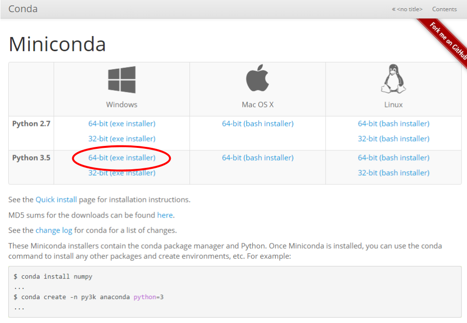
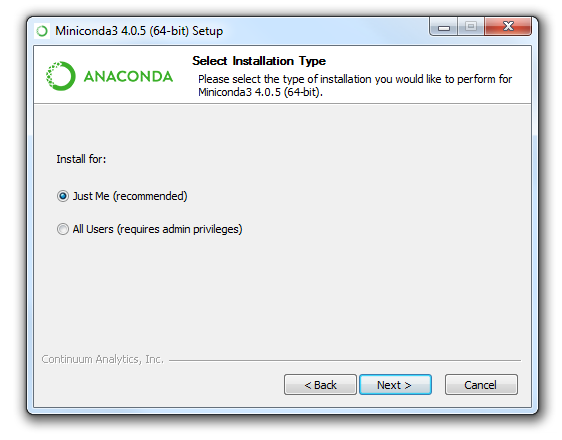
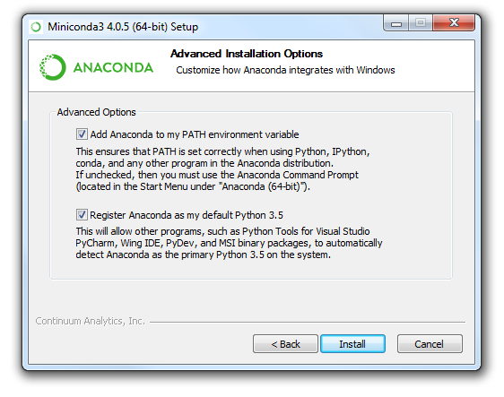
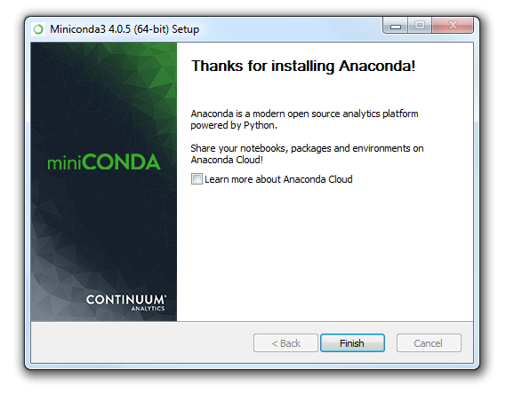
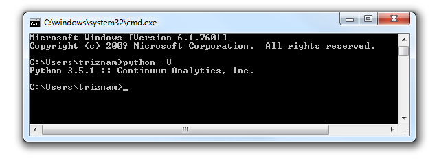

## Installing miniconda on Windows

This guide is focused on how to install the miniconda package on a Windows machine.

### Background

[Continuum Analytics](https://www.continuum.io) has developed the Anaconda package management system for Python. This is a powerful tool that allows users to install packages easily and without root access. It also allows for simple control over virtual environments (called conda envs) that make dependency resolution for particular software or pipelines a breeze.

The entire Anaconda package is quite large. Rather than installing the whole thing, we will be installing [miniconda](http://conda.pydata.org/miniconda.html). Miniconda simply installs Python and the machinery to add additional packages that are enabled in the conda package management system. After we have finished installing miniconda, we will install a couple of useful packages that we plan to use during this workshop.

### Install Guide

Navigate to the [miniconda website](http://conda.pydata.org/miniconda.html). Click on the "64-bit (exe installer)" link underneath "Windows".



It should download a file called "Miniconda3-latest-Windows-x86_64.exe" to your Downloads folder. When it is done downloading, double-click on this file to begin the installation process.

Agree to the License Agreement, and click Next. 

Select "Just Me" when it asks who to install for, and click Next.



Accept the default value for Install Location and click Next.


Ensure that both of the Advanced Installation Options checkboxes are selected, and then click Install.



It will take a little while (just a minute or 2) going through the actual installation, but you should finally get a success message. Uncheck the option to "Learn more about Anaconda Cloud" (unless you really want to), and click Finish.



### Verify Installation

Open a command prompt, and enter the following command. (**That is a Captial V**)

```
python -V
```

You should see the following response:



### Use conda to install Jupyter

Now that you're setup, we'll install a couple of important Python packages using the conda package manager. The first one that we will install is Jupyter so that we can take advantage of Jupyter notebooks later in the class. To do this, you only need to enter a single simple command:

```
conda install jupyter
```

Jupyter requires many other dependencies outside of the vanilla Python install. Fortunately, conda knows this and will automatically install each dependency that Jupyter requires. After issuing the command above, you will receive a prompt with the names of the dependencies that need to be installed/upgraded. Additionally, you will receive a prompt requesting whether you wish to proceed with the install:

```
Proceed ([y]/n)?
```

Go ahead and press ENTER. Conda will then install all necessary packages to your system.

That's all that we'll install for now. I hope this give you a good idea of how to easily install Python packages using conda.
