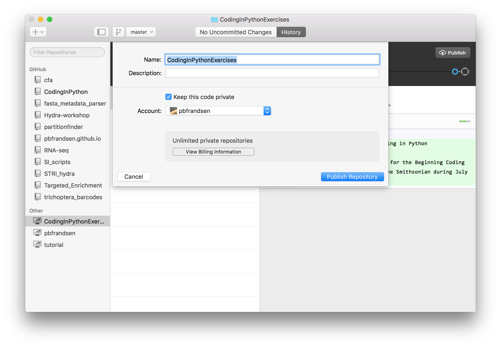

##Git and GitHub
This workshop is focused on coding in Python, however, we also wish to teach participants good coding practice and some tricks and tips that can make your life easier. One of these tools that can really make life simpler is the use if Git and GitHub.

Git is a version control system. It is set up to keep track of different versions of your code and the changes that you have made between different versions. It was written by Linus Torvalds who wrote the popular open source operating system, Linux (Linus + Unix). There are other version control systems in use such as Subversion (SVN) and Mercurial. Git is arguably the most popular partly due to the ease of use through GitHub.

For this course, we are striving to use technologies that have widespread use and that we think will be the most useful. For this reason, we have chosen to teach Git and the GitHub app.

Let's first take a look at the GitHub app:


As you can see, the screenshot shows the tutorial selected. The tutorial is useful and will give you an overview of how to use the app. For now, I will just point out a couple of useful features that we'd like to you use as you develop scripts for this class. The first thing that you should do it create a new repository. You do this by clicking on the "+" button in the top left hand corner. Name your repository "CodingInPythonExercises".


When you create the repo it will give you the option to specify the Path. ```~/GitHub/CodingInPythonExercises``` is a reasonable path for the repository.

Now you can open the folder in Finder (on a mac). By "right clicking" (two finder click on the trackpad, or control + click) on the "CodingInPython" label in the lefthand pane and selecting, "Open in Finder" ("Open in Explorer" for PCs). This should give you an empty folder.

To get started, you might want to create a text file called README.md. You can enter a little bit about your project in the README file. Once you write a little bit about the project, you can save it to the folder with the name "README.md". Your GitHub App will then update automatically and look something like this:


Now we're going to 'commit' our code. In Git, a `commit` is when you 'commit' something to be added to the repository. Along with the commit, you are required to enter some sort of summary and an optional description. The summary should be short and descriptive. The description can add more information if needed. There are strong opinions on how to write good commit message. If you google it, you'll find lot's of opinions. In my opinion, a good commit message will never be longer than necessary (the 'summary' part should be fewer than 80 characters, if you need more, move it to the description). Ideally, you'd have some information on why the change you are posting in needed. Since this is the first commit with just a README, I put a simple summary without a description.


Now go ahead and press 'commit'. Then press the 'Publish' button on the top right. You will use this button the first time that you create a repository. Afterward, you will simply sync the repository.



It will ask you if you want to keep your code private, uncheck that box. Then press on 'Publish Repository'. Now when you visit your GitHub account, the new repository should show up along with your README. To continue to add new files to your repository, you simply save them to the folder and the GitHub app does the rest.