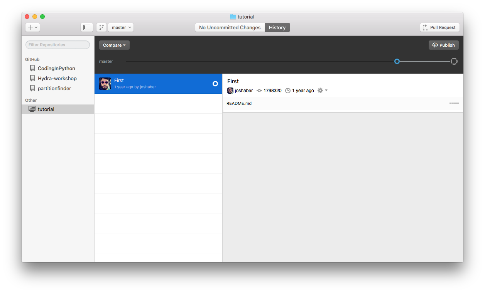
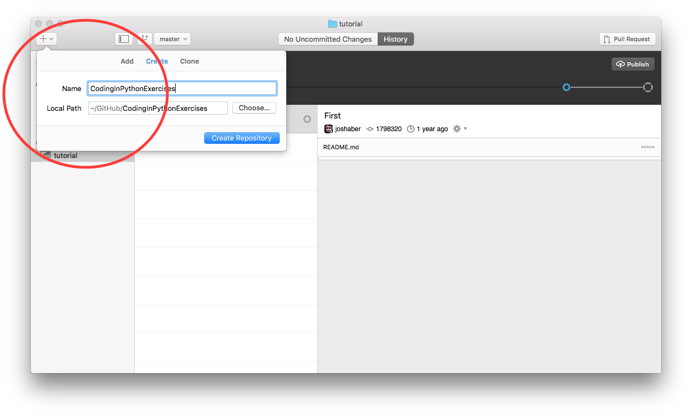
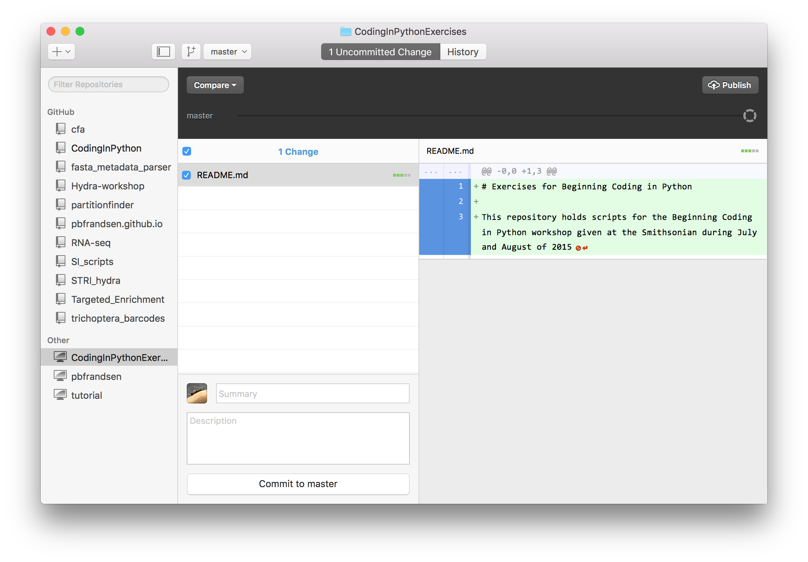

##Git and GitHub
This workshop is focused on coding in Python, however, we also wish to teach participants good coding practice and some tricks and tips that can make your life easier. One of these tools that can really make life simpler is the use if Git and GitHub.

Git is a version control system. It is set up to keep track of different versions of your code and the changes that you have made between different versions. It was written by Linus Torvalds who wrote the popular open source operating system, Linux (Linus + Unix). There are other version control systems in use such as Subversion (SVN) and Mercurial. Git is arguably the most popular partly due to the ease of use through GitHub.

For this course, we are striving to use technologies that have widespread use and that we think will be the most useful. For this reason, we have chosen to teach Git and the GitHub app.

Let's first take a look at the GitHub app:



As you can see, the screenshot shows the tutorial selected. The tutorial is useful and will give you an overview of how to use the app. For now, I will just point out a couple of useful features that we'd like to you use as you develop scripts for this class. The first thing that you should do it create a new repository. You do this by clicking on the "+" button in the top left hand corner. Name your repository "CodingInPythonExercises".



When you create the repo it will give you the option to specify the Path. ```~/GitHub/CodingInPythonExercises``` is a reasonable path for the repository.

Now you can open the folder in Finder (on a mac). By "right clicking" (two finder click on the trackpad, or control + click) on the "CodingInPython" label in the lefthand pane and selecting, "Open in Finder". I imagine that the workflow is similar on a PC. This should give you an empty folder.

To get started, you might want to create a text file called README.md. You can enter a little bit about your project in the README file. Once you write a little bit about the project, you can save it to the folder with the name "README.md". Your GitHub App will then update automatically and look something like this:


