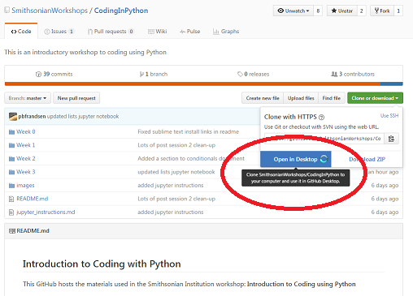
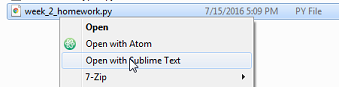

# Week 3 (July 21, 2016)

### Week 2 Homework Review

#### GitHub Cloning

To test some of the things we learned in Week 2, let's start out by using GitHut to "clone" this CodingInPython repo, as a way to download the homework assignment.

If you already have GitHub set up (see [Week 2 Git and GitHub Instructions](../Week\ 2/Git\ and\ Github.md)), simply press the "Clone or download" button on the repository home page, and select "Open in Desktop". 

This will open GitHub Desktop, and ask you where on your computer you want to save the files. Choose a sensible location, and the GitHub program will save all files in this repo to your computer.

Next, right-click on the CodingInPython listing, and choose "Open in Explorer" (PC) or "Open in Finder" (Mac). Now navigate to the Week 2 folder, right-click on the "week_2_homework.py" file and choose "Open with Sublime Text".

#### Configuring Sublime Text

### Jupyter Notebook

### Class

For loops

Reading files

Lists

### Week 3 Homework Assignment

