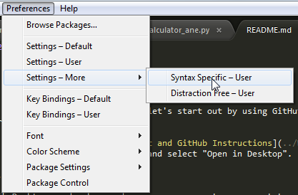

# Week 3 (July 21, 2016)

### Week 2 Homework Review

#### GitHub Cloning

To test some of the things we learned in Week 2, let's start out by using GitHut to "clone" this CodingInPython repo, as a way to download the homework assignment.

If you already have GitHub set up (see [Week 2 Git and GitHub Instructions](../Week\ 2/Git\ and\ GitHub.md)), simply press the "Clone or download" button on the repository home page, and select "Open in Desktop". 


This will open GitHub Desktop, and ask you where on your computer you want to save the files. Choose a sensible location, and the GitHub program will save all files in this repo to your computer.


Next, right-click on the CodingInPython listing, and choose "Open in Explorer" (PC) or "Open in Finder" (Mac). Now navigate to the Week 2 folder, right-click on the "week_2_homework.py" file and choose "Open with Sublime Text".


#### Configuring Sublime Text

Since we're dealing with "nested" statements, indentation is going to be really important. You can set up Sublime Text to automatically convert tabs to spaces in Python files, which should save you a lot of headaches.

With your Python file open, click on Preferences, then "Settings - More", and then "Syntax Specific - User". On a Mac, Preferences can be found under the Sublime Text heading up top.



This should open a blank file called "Python.sublime-settings". Copy and paste this snippet into that file, and press Save.

```
{
    "tab_size": 4,
    "translate_tabs_to_spaces": true
}
```

### Jupyter Notebook

We will be following along with Jupyter Notebooks in class today, so we all we need to have that those set up to run on your computers. Paul sent out instructions on how to do this a week or 2 ago, but we'll go through it right now.

To install jupyter notebooks, open a Terminal or Command Prompt and type:

```
conda install jupyter notebook
```

The conda system will then do some work, and then ask you if you want to instally jupyter (along with several other packages). Press "y" and then Enter. Conda will then download all of those packages and install them on your computer for you.

Finally, type:

```
jupyter notebook
```

which will launch an instance of Jupyter Notebook in your browser. Navigate to where you have the CodingInPython class repository cloned to, and open the "for_loop.ipynb" file to begin.

### Class Notebooks

[For loops](for_loops.ipynb)

[Reading files](Reading\ files.ipynb)

[Lists](Lists.ipynb)

### Week 3 Homework Assignment

Your homework assignment is to read in a file called "sequences.txt" that will contain 1 or more DNA sequences -- 1 per line. Here are example file contents:

```
AGCTCGATCGATACG
GGCTCTCAAG
CTAGCTAGACGA
```

Calculate the GC content for each sequence, and only print out the highest GC content value.
