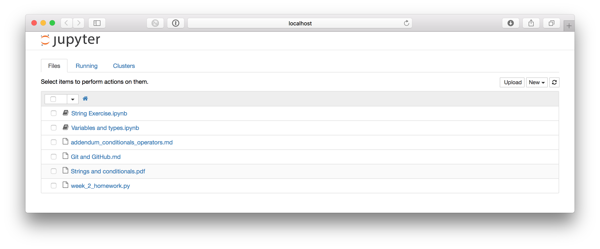

## Downloading and viewing Jupyter notebooks

The best way to view the Jupyter notebooks is to clone the CodingInPython GitHub repository so that you have it on your computer hard drive.

As mentioned in class, you can do this by navigating to [Coding in Python](https://github.com/SmithsonianWorkshops/CodingInPython). Click on the "Clone or download" button and choose to "Open in Desktop".

One you have cloned the repo, you can open the folder in finder by "right clicking" on the repo name in your GitHub app and selecting "Open in Finder". That should open the folder containing the course contents.

Now go back to your terminal window and `cd` into the 'Week 2' directory. An easy way to do this on a mac is to type `cd` into the terminal window, then drag the Week 2 directory into your terminal window. That way, it will automatically add the PATH to your terminal window. One you have navigated to the Week 2 directory within the CodingInPython repo, enter the command:

```
$ jupyter notebook
```

This will open your browser with the a few items listed.



Two of them will be the Jupyter notebooks that we used in class yesterday. Go ahead and click on one of them. 

Now you have access to the Jupyter notebook!

Feel free to play around with the options and to run bits of code to see what happens.

